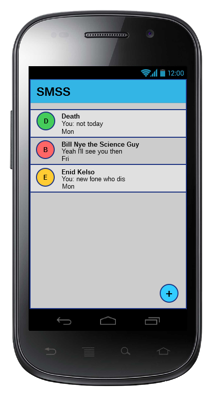
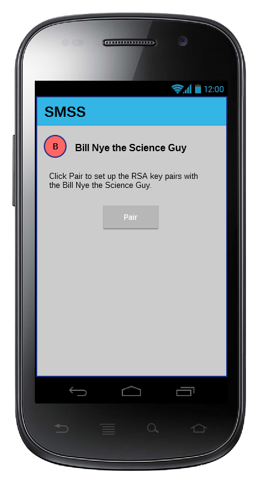
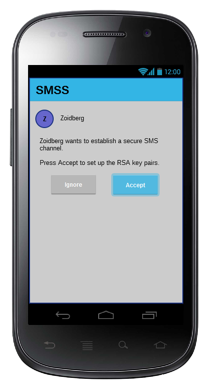

# SMSS (Short Messages Service Secure)

With today’s ever increasing government surveillance and privacy-intruding services and policies, it can be difficult to send sensitive information to someone and ensure that only the intended person can access said information. The more secure way to combat this is through the use of encryption. Even though there are numerous encrypted communication applications on the market, most of them seem to neglect a certain market: people who have restrictive or non-existent mobile data. SMS (Short Message Service), on the other hand, has matured to be a cheap and reliable method of communication that every cell phone user has access to. We aim to develop an application that creates a secure channel of communication via SMS with the use of encryption. An added bonus of the application is that there’s no need to register for an addition account for use. 

---------------------------------------

### Update 9/23/2016
During the course of the week, we researched on the details of possible external library requirements and the usage of internal Android APIs, specifically the APIs for SMS and/or MMS communication. Namely, we discovered that java.security provides RSA encryption and decryption methods, so external libraries are not required on that front. In addition, java also provides ZipStream, which allows us to compress the messages for greater efficiency in regards to the SMS character limitation. Lastly, we read over the reference for SMS related Android APIs such as SmsManager to familiarize ourselves with their usage. The next step is to begin building the UI component of the application, namely the conversations list and the messages screen. Once we have the barebones UI and basic SMS features complete, we will then start on message encryption and decryption. 

---------------------------------

### Intended Audience
* People who want a easy, secure, and private way of communication (free from surveillance and eavesdropping)
* People who don’t have access to mobile data or have low mobile data quotas
* People who are wary of registering accounts (and thus giving out their email, name etc.)

### Wireframes

### Platform Architecture

### Core Functionality
* **Encrypt and send / receive and decrypt messages over SMS**
  * The encryption/decryption method used is RSA public key/asymmetric cryptosystem. Therefore, before a user can communicate securely with another user, they will need to “pair” with each other through the process of sending each other their respective public keys (via specially formatted SMS messages). Once each user has the other’s public key, the sender can encrypt the message with the receiver’s public key and the receiver can decrypt the message with its own private key. A new RSA key pair will be generated for each contact/pairing process to ensure users cannot decrypt messages not explicitly sent to them.  

### Stretch Goals
* Encrypted binary file sharing such as pictures and videos and encrypted group messaging functionality via MMS (Multimedia Messaging Service).
* Compression to allow less SMS data to be used. Transmitted messages will be compressed before being encrypted.
* Basic caching to allow for messages sent in quick succession to be condensed into fewer SMS messages.

### Mobile Features
SMS/MMS

### Expected Limitations
* Secure storage of the private keys for each paired user
* Effective storage of the public keys for each paired user
* Message length limitations imposed by SMS (160 characters) (Resolved by splitting the message and sending each part as a separate SMS message) 
* Long messages may be split by the mobile carrier and parts may be delivered in the wrong order (Resolved by adding a special header to each SMS message containing the total count of SMS messages in the chain and the number of the current SMS message)

### Marketing Plan
We will initially advertise the app within the Tufts community and among the Tufts Computer Science department. Advertising will include word-of-mouth and Facebook posts.
