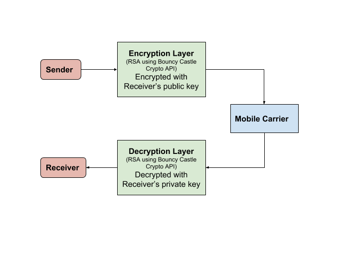

# SMSS
### Briefly explain the need for the app (the "what")
With today’s ever increasing government surveillance and privacy-intruding services and policies, it can be difficult to send sensitive information to someone and ensure that only the intended person can access said information. The more secure way to combat this is through the use of encryption. Even though there are numerous encrypted communication applications on the market, most of them seem to neglect a certain market: people who have restrictive or non-existent mobile data. SMS (Short Message Service), on the other hand, has matured to be a cheap and reliable method of communication that every cell phone user has access to. We aim to develop an application that creates a secure channel of communication via SMS with the use of encryption. An added bonus of the application is that there’s no need to register for an addition account for use. 

### List the stakeholders and customers of the apps (the "who")
* People who want a easy, secure, and private way of communication (free from surveillance and eavesdropping)
* People who don’t have access to mobile data or have low mobile data quotas
* People who are wary of registering accounts (and thus giving out their email, name etc.)

### Using wireframes, sketch the most important views of the app.
[Coming soon]

### Diagram or sketch the architecture of the platform. The platform is what powers the app. 

### List and briefly describe the core functionality of the app, the most important functions and transactions of the app.
* **Encrypt and send / receive and decrypt messages over SMS**
  * The encryption/decryption method used is RSA public key/asymmetric cryptosystem. Therefore, before a user can communicate securely with another user, they will need to “pair” with each other through the process of sending each other their respective public keys (via specially formatted SMS messages). Once each user has the other’s public key, the sender can encrypt the message with the receiver’s public key and the receiver can decrypt the message with its own private key. A new RSA key pair will be generated for each contact/pairing process to ensure users cannot decrypt messages not explicitly sent to them.  

### List and briefly describe the secondary functionality of the app, the functions and transactions of the app that are nice to have only if time allows.
Encrypted binary file sharing such as pictures and videos and encrypted group messaging functionality via MMS (Multimedia Messaging Service).

### List the features on a mobile device that the app will use (e.g., camera, GPS, SMS, flashlight).
SMS/MMS

### Briefly describe any limitations each team member may feel that will hold back progress.
* Secure storage of the private keys for each paired user
* Effective storage of the public keys for each paired user
* Message length limitations imposed by SMS (160 characters) (Resolved by splitting the message and sending each part as a separate SMS message) 
* Long messages may be split by the mobile carrier and parts may be delivered in the wrong order (Resolved by adding a special header to each SMS message containing the total count of SMS messages in the chain and the number of the current SMS message)

### Briefly describe how your team plans to market or advertise the app.
We will initially advertise the app within the Tufts community and among the Tufts Computer Science department. 
